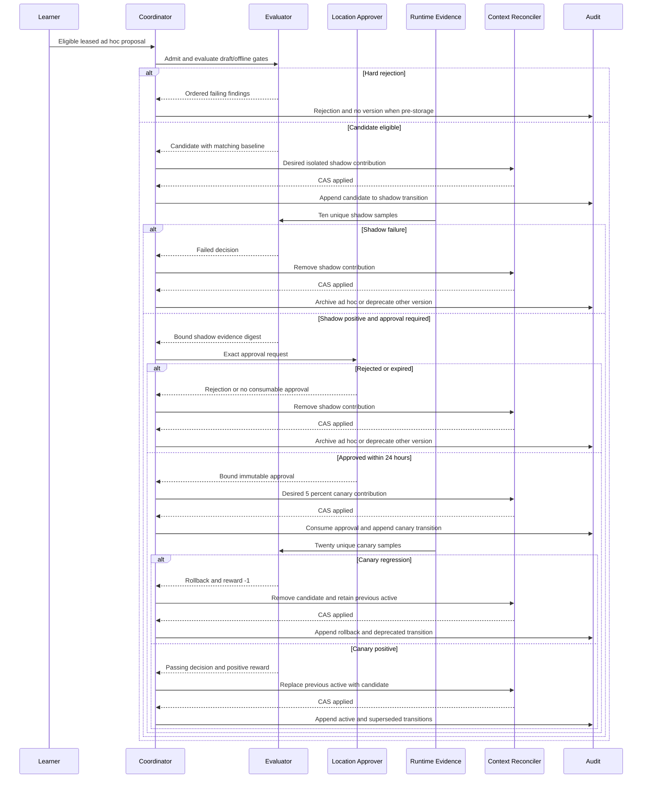
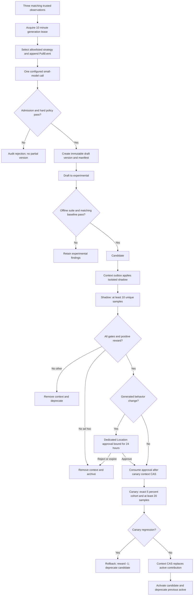

# Smart Self-Improvement MVP Design

Status: Approved design, pending written review
Date: 2026-07-17

## 1. Goal and Authority

Build an app-private, safety-constrained self-improvement lifecycle that manages six artifact kinds, preserves immutable versions and append-only evidence, evaluates seven quality dimensions, promotes safe versions through shadow and canary, learns only among allowlisted actions, generates bounded ad hoc skills from repeated evidence, and injects eligible skills as Location-scoped System Context contributions.

The MVP is a thin vertical walking skeleton. It uses real schemas, database persistence, services, private APIs, authorization, evaluation, lifecycle, audit, bandit projections, context reconciliation, and clock semantics. Only model output and runtime samples are deterministic fakes in E2E.

Normative precedence is:

1. explicit requirements in this design;
2. current live repository source and schemas;
3. repository defaults and conventions; and
4. durable memory or prior design notes.

Current live source always wins over stale memory. An explicit requirement here wins over a conflicting repository default. A discovered conflict with a higher-precedence source blocks the affected slice; it is not silently adapted.

### 1.1 Canonical Live Dependencies

| Dependency | Required use | MVP boundary |
| --- | --- | --- |
| Slice 1A parser and structural schemas | Admit raw bytes, enforce size/UTF-8/JSON/duplicate-key rules, produce canonical JSON and input digests | Call the live kernel; never duplicate or weaken it |
| `Policy` | Authorize provider/model use and enforce runtime permissions | Learner output cannot modify or bypass it |
| `Catalog` | Resolve configured providers, models, defaults, fallbacks, and availability | Learner may select only existing Catalog identities |
| Variant plugin materialization | Materialize already-configured variants before route eligibility | Learner cannot create variants |
| `SessionRunnerModel` | Validate the selected model API and execute the final resolved route | Every learned route passes through it |
| Ordered System Context registry | Render trusted envelopes and Location-scoped contributions in fixed order | Generated content is always subordinate to core safety content |
| `Location` | Own artifacts, grants, principals, context, evidence, buckets, and audit | No global or cross-Location fallback exists |
| Live database and migration framework | Enforce immutable evidence, uniqueness, serialization, outbox, and retention metadata | No test-only store or bypass exists |
| Configured small-model resolution | Resolve the existing small model used for proposal generation | Missing resolution records a failed attempt; no model/provider settings are synthesized |

Slice 1A already provides strict raw-byte proposal parsing, schemas for all six kinds, canonical JSON, rejected-byte digests, and accepted input-snapshot digests. All proposal sources use it.

## 2. Scope

### 2.1 Artifact Kinds

The lifecycle supports `agent`, `skill`, `workflow`, `mode`, `command`, and `routing-policy`.

### 2.2 Non-Goals

- public Protocol, SDK, plugin, or MCP APIs;
- first-party UI screens;
- live production shadow or canary traffic;
- automatic generation for kinds other than ad hoc skills;
- unrestricted reinforcement learning;
- learned permissions, governance, approval, gates, or transitions;
- active-stage regression monitoring or automatic active rollback;
- learner-created provider settings, credentials, endpoints, models, or variants; and
- physical deletion through normal CRUD.

Only canary regression automatically rolls back. Active-stage regression is explicitly deferred.

## 3. Glossary

| Term | Normative definition |
| --- | --- |
| Matching observation | A trusted, redacted observation in the same Location whose HMAC identity has the same workload, error class, ordered tool/symbol digest, and outcome class within the rolling 30-day window |
| Eligible arm | An active allowlisted arm that passes all pre-selection policy, availability, capability, stage, and bucket checks |
| Positive evidence | Complete trusted evidence with all applicable gates passing and aggregate reward greater than zero |
| Improving sample | A valid candidate sample whose paired aggregate contribution improves at least one metric and violates no applicable non-regression or budget gate |
| Complete audit chain | Admission/generation, evaluation, sample cutoff, approval when required, context outbox, transition, routing, reward, and terminal outcome records linked by immutable IDs and digests |
| Active recommendation | The highest-scoring eligible model-route arm activated after complete canary evidence; it is advisory and remains below explicit session/user and role routes |
| Ephemeral | An ad hoc version that auto-archives if not promoted by its retention deadline; it is never immediately deleted |
| Baseline | An immutable Location + workload + suite-revision control aggregate built from at least 20 unique trusted samples |
| Workload | A revisioned, allowlisted class that groups comparable tasks for baseline, suite, bucket, and routing decisions |
| Task | One immutable accepted runtime request bound to a Location, workload, suite revision, stage, version, and task ID digest |
| Success | A terminal accepted task outcome that passes the suite's required correctness condition |
| Repeated issue fingerprint | A Location-keyed HMAC over the normalized issue class and affected stable identifiers, never raw content |
| Precision | Accepted relevant, non-extraneous assessed changes or claims divided by all assessed changes or claims |
| Tombstone | The terminal artifact operation that reserves its Location + kind + name, archives every version, removes rollout contributions, and forbids further normal mutation |

## 4. Safety and Isolation Invariants

1. Artifacts own exactly one immutable Location. Versions inherit it and do not duplicate Location scope.
2. Every reference resolves only inside the owning Location.
3. Generated output never bypasses Slice 1A, semantic gates, capability policy, or authorization.
4. Generated routing policies are rejected before version storage.
5. Generated agents without an active baseline are rejected before version storage.
6. Runtime permissions and Location grants remain authoritative over generated text and manifests.
7. Generated executable or behavior-changing versions may enter shadow automatically but require exact bound approval before canary.
8. Required gates cannot be removed; overrides may only add gates or tighten thresholds.
9. Version content, capability manifests, approvals, samples, transitions, rewards, and audit entries are immutable until retention or governance deletion.
10. No caller can set a current stage directly.
11. At most one active, one shadow, and one canary version exist per artifact.
12. Tombstoned names remain reserved and normal CRUD is tombstone-only.
13. Raw prompts, transcripts, secrets, credentials, tool arguments, and remote embedded content are not learning data.
14. All reads, writes, uniqueness, evidence, routing, learning, and audit are Location-scoped. Cross-Location access is denied without fallback.

### 4.1 Names and References

The typed artifact key is `(Location ID, kind, name)`. A live artifact name is unique by this key. Tombstoned keys remain reserved forever except through the separate governance deletion process.

Reference resolution uses only non-tombstoned artifacts in the source artifact's Location:

| Reference form | Resolution | Failure |
| --- | --- | --- |
| Typed | Exact `(Location, kind, name)` match | Zero matches: `reference-unresolved`; more than one indicates database corruption and fails `reference-ambiguous` |
| Untyped | Exactly one non-tombstoned artifact with `name` across all kinds in the Location | Zero: `reference-unresolved`; multiple: `reference-ambiguous` |

The candidate version participates in cycle detection but is not treated as a resolvable installed artifact until stored. Direct and transitive self-reference fail `reference-cycle`. No cross-Location lookup, global fallback, or tombstoned match is permitted.

## 5. Principals and Authorization

Each service identity is dedicated, authenticated, and granted to one Location. A Location has exactly one dedicated approver identity at a time; rotation does not alter consumed approvals.

| Operation | First-party user | Location approver | Runtime-evidence service | Evaluator | Coordinator | Audit reader |
| --- | --- | --- | --- | --- | --- | --- |
| List/get live artifacts and versions | Allow in own Location | Allow | Deny | Allow as needed | Allow as needed | Allow |
| Create artifact/version | Allow in own Location | Deny | Deny | Deny | Allow only for admitted generated output | Deny |
| Tombstone or archive | Allow with revision | Deny | Deny | Deny | Allow only for policy-driven terminal action | Deny |
| Approve/reject exact version | Deny | Allow if not creator | Deny | Deny | Deny | Read only |
| Ingest observations or metric runs/samples | Deny | Deny | Allow | Deny | Deny | Deny |
| Execute generation/model boundary | Deny | Deny | Deny | Deny | Allow | Deny |
| Evaluate and decide a bound run | Deny | Deny | Deny | Allow | Request/read only | Read only |
| Transition stages/rollback | Deny | Deny | Deny | Deny | Allow only through event policy | Read only |
| Select arms/update rewards or projections | Deny | Deny | Deny | Emit evaluation outcome only | Allow | Read only |
| Reconcile System Context outbox | Deny | Deny | Deny | Deny | Allow | Read only |
| Read privileged audit/evidence | Deny by default | Own approval evidence only | Own submissions only | Evaluation evidence | Operational evidence | Allow |

Authorization is checked against the authenticated principal, operation, artifact-derived Location, and explicit Location header before any idempotency replay. A principal grant for Location A never authorizes discovery, reads, error detail, or mutation in Location B. Not-found and cross-Location artifact access both return `404 artifact-not-found` to non-audit principals.

Only trusted service identities ingest observations or metrics, execute generation, decide evaluations, update pulls/rewards, or transition stages. User-supplied claims cannot become runtime evidence.

## 6. Architecture

### 6.1 Components

| Component | Responsibility |
| --- | --- |
| Admission adapter | Calls Slice 1A and emits accepted canonical proposal or redacted rejection evidence |
| Library | Owns artifacts, versions, suites, baselines, runs, evidence, approvals, transitions, observations, learning events, outbox, and audit |
| Evaluator | Runs applicable gates in stable order and decides exactly one bound run |
| Coordinator | Serializes lifecycle events, generation leases, bandit pulls/rewards, rollback, and desired context changes |
| Runtime-evidence ingress | Authenticates trusted producers and validates immutable runs/samples |
| Learner | Groups redacted observations and selects allowlisted generation strategies or model routes |
| Context reconciler | CAS-applies durable desired System Context state and finalizes pending transitions |
| Private API | Exposes authenticated commands and reads without a generic stage endpoint |

### 6.2 Generated Skill Content Boundary

Generated skills are untrusted data. Slice 1A must accept the proposal, then the content gate parses Markdown and allows only this bounded AST inside a trusted subordinate System Context envelope:

- maximum UTF-8 content size: 32 KiB;
- maximum 512 AST nodes and depth 8;
- allowed nodes: document, paragraph, headings levels 2-4, plain text, emphasis, strong, inline code, fenced code block, bullet list, ordered list, and list item;
- no raw HTML, links, images, embedded media, includes, remote content, data URLs, or autolinks;
- no role/system delimiters or tokens that impersonate system, developer, assistant, tool, or user messages;
- no instructions to ignore, override, reveal, reorder, weaken, or reinterpret prompts, policy, permissions, gates, approval, audit, or runtime enforcement; and
- no direct execution. Code blocks and commands remain inert text.

The registry renders a trusted envelope containing artifact/version identity, untrusted-content markers, and fixed subordinate precedence. Generated Markdown occupies only the escaped body slot. It is never a user message and never precedes core safety/governance contributions. Runtime permission checks, not prose, authorize tools and resources.

### 6.3 Capability Manifest

Every version stores one immutable `CapabilityManifest` in canonical form and includes its digest in the version digest. It contains only statically enumerable identifiers for tools, filesystem scopes, network origins, model routes, child-agent targets, referenced artifacts, and explicit denies. Wildcards not defined by live Policy, dynamic expressions, interpolation, unknown identifiers, and runtime-discovered capabilities fail `capability-dynamic-or-unknown`.

Effective capability resolution is deterministic:

1. Resolve references in the owning Location.
2. Compute the kind-specific requested set.
3. Traverse workflow/mode references transitively in canonical reference order; any cycle fails `reference-cycle`.
4. Intersect the requested set with the immutable Location grant snapshot bound to evaluation.
5. Reject if the intersection differs from the requested set; intersection never silently makes an overbroad proposal valid.
6. For generated versions, require the result to be a subset of the active same-kind baseline's effective capabilities. A generated non-agent with no active same-kind baseline uses the empty capability set, so it may contain instructions but cannot introduce runtime capability. A generated agent with no active agent baseline is rejected before storage. Added deny rules are allowed; removed or weakened deny rules fail.
7. For an ad hoc skill, also intersect with the originating task envelope and reject any requested capability outside that envelope.

| Kind | Requested capability source |
| --- | --- |
| `agent` | Own manifest plus referenced skills/workflows/modes; generated agent requires an active agent baseline |
| `skill` | Own manifest and transitive referenced workflow/mode capabilities |
| `workflow` | Own manifest plus the union of every transitive step/reference capability |
| `mode` | Own manifest plus the union of every transitive workflow/skill/agent reference |
| `command` | Own manifest plus its referenced workflow/skill capabilities |
| `routing-policy` | Own existing provider/model route declarations; generated versions are always rejected |

Generated content cannot grant a capability by naming it. Missing baseline, unresolved reference, cycle, unknown capability, grant excess, baseline expansion, or originating-task excess is a hard failure before shadow.

### 6.4 System Context Selection

- Shadow skill versions render only in isolated replay context.
- Canary skill versions render only after approval for the exact deterministic 5% cohort.
- Active skill versions render for the originating Location.
- Rollback, deprecation, archive, and tombstone remove their rollout contribution after successful reconciliation.
- At most one shadow and one canary contribution exist per artifact.
- Every selection records artifact/version/digest, Location, stage, context epoch, session digest, cohort result, and outbox ID.

The exact canary cohort calculation is:

```text
u64 = first unsigned 64 bits, big-endian, of SHA-256(versionDigest + NUL + sessionDigest)
inCanary = (u64 / 2^64) < 0.05
```

`versionDigest` and `sessionDigest` are lowercase canonical hex inputs; `NUL` is one `0x00` byte. This produces the exact 5% threshold without modulo bias.

## 7. Persistence Contracts

Every entity below includes an immutable owning Location directly or through an enforced artifact/run foreign key. Queries and constraints include Location even when the foreign key already implies it.

| Entity | Immutable key and required fields |
| --- | --- |
| Artifact | ID, Location ID, kind, name, created actor/time, tombstone actor/time, optimistic revision |
| ArtifactVersion | ID, artifact ID, monotonic number, source, behavior class, proposal JSON/digest, input digest, capability manifest/digest, creator/time, optional strategy pull ID |
| StageTransition | ID, version ID, previous/next stage, event, reason, actor/time, evaluation/approval/rollback/outbox refs, idempotency identity |
| SuiteRevision | suite ID + revision, workload/kind applicability, ordered gates, thresholds, sample minima, creator/time |
| Baseline | ID, Location, workload, suite revision, sample-set digest/count, aggregate fields, authority/time |
| EvaluationRun | ID, Location, version, stage, workload, suite revision, baseline, state, acceptance window, cutoff, request digest, decision/time |
| MetricSample | run ID + sample ID digest, task ID digest, producer, immutable request digest, seven raw metric components, outcome/time |
| GateFinding | evaluation ID + stable order, gate ID, pass/fail/not-applicable, code, pointer, structured details |
| Approval | ID, Location, version/digest, suite revision, evaluation run, shadow evidence digest, approver, decision/time, expiry, consumed time |
| Rollback | ID, Location, artifact/candidate/retained-active IDs, canary run, reason, reward ID, time |
| Observation | ID, Location-keyed HMAC identity, redacted fields, trusted producer/time, expiry |
| GenerationLease | pattern identity, lease owner/token, attempt number, acquired/expiry/completion times, model request/output digests, outcome |
| PullEvent | ID, Location, action domain, bucket/revisions, ordered eligible arms, selected arm, proposal/session/version refs, time |
| RewardEvent | ID, Location, pull ID, outcome class, optional numeric reward, evidence digest, time |
| BanditState | Projection key, pull total, rewarded pull total, cumulative/mean reward, active flag, latest event IDs |
| RoutingDecision | ID, Location, session/workload/role digests, precedence source, snapshots, eligible arms, selected route/reason, pull ID, time |
| ContextDesiredState | Location + artifact rollout slot, desired version/digest/stage or absent, desired revision |
| ContextOutbox | ID, artifact, expected revision/stage, desired-state revision, pending transition intent, status/attempts/next retry, CAS result |
| AuditEntry | ID, Location, event type, actor, redacted allowlisted payload, linked IDs/digests, trusted time |
| IdempotencyRecord | principal + Location + operation + key, request digest, stored status/body digest/body, created/expiry time |

ArtifactVersion does not store a separate Location scope. Its Location is the artifact's Location. Observation identity, runs, samples, buckets, arms, rewards, routing decisions, uniqueness, context, and audit all include or inherit that same Location.

Normal writes never update immutable evidence rows. Projection rows may be transactionally rebuilt from immutable events. Retention or regulatory deletion is the only removal path described in Section 16.

## 8. Baselines, Runs, and Samples

### 8.1 Baselines

A baseline is immutable for exactly `(Location, workload, suite revision)`. It requires at least 20 unique trusted control samples accepted under one deterministic cutoff.

Required fields are baseline ID, Location, workload and workload revision, suite ID/revision, producer allowlist revision, control source, acceptance window, cutoff, unique sample count, ordered sample-ID digest, all metric numerators/denominators and aggregates, created time, evaluator signature, and bootstrap authority.

Bootstrap authority is the dedicated Location approver acting on an evaluator-produced control aggregate. Bootstrap may create the first baseline for a tuple but cannot lower suite requirements. Later baselines require a new suite revision or workload revision; an existing baseline is never replaced. No candidate enters shadow without a matching baseline. E2E seeds both a valid baseline and a previous active version.

### 8.2 Evaluation Run State

Runs have states `open`, `deciding`, `decided`, or `cancelled`.

- Creation immutably binds Location, version, stage, suite revision, workload revision, baseline, trusted producer set, acceptance start/end, and request digest.
- `open` accepts valid samples only inside the window and while the bound version remains in the bound stage.
- At the deterministic cutoff, the evaluator CAS-transitions `open -> deciding`, snapshots accepted sample IDs in lexical digest order, evaluates once, then writes `deciding -> decided` with exactly one decision.
- Cancellation CAS-transitions `open -> cancelled`. Cancelled runs have no decision and their samples satisfy no minimum.
- Duplicate run ID or sample ID with the same request digest returns the original stored result. A different digest returns `409 idempotency-mismatch`.
- Late, wrong-stage, wrong-version, wrong-suite, wrong-workload, untrusted-producer, or post-cutoff samples are rejected and audited; they never enter an aggregate.
- A crash in `deciding` resumes from the immutable cutoff snapshot. The decision uniqueness constraint prevents a second decision.

The candidate minimum is 10 unique valid samples for shadow and 20 for canary. Baseline samples cannot also be candidate samples. A unique task ID contributes at most once per run; repeated submissions do not increase counts.

### 8.3 Metric Dictionary

| Metric | Per-task numerator / denominator or value | Aggregate and range | Trusted producer |
| --- | --- | --- | --- |
| `taskQuality` | Earned allowlisted suite quality points / possible points | Sum earned / sum possible; `[0,1]` | Evaluator from deterministic suite results |
| `correctness` | Passed required deterministic checks / required checks | Sum passed / sum required; `[0,1]` | Evaluator |
| `repeatFixRate` | `1` when the completed task repeats a prior Location/workload issue fingerprint in the 30-day window, else `0` / completed task | Repeated completed tasks / completed tasks; `[0,1]`, lower is better | Runtime-evidence service with evaluator-validated fingerprint |
| `precision` | Accepted relevant non-extraneous assessed items / all assessed items | Sum accepted / sum assessed; `[0,1]` | Evaluator |
| `latencyMs` | Trusted terminal time minus trusted start time | Finite integer `>=0`; P95 is sorted nearest-rank value at one-based rank `ceil(0.95 * n)` | Runtime-evidence service clock |
| `tokensPerSuccess` | Input + output tokens for every accepted task, including failed tasks / successful tasks | Total tokens across successes and failures divided by success count; finite `>=0`; zero successes fails | Runtime-evidence service from provider accounting |
| `cacheHitRatio` | Cache-read tokens / cache-eligible tokens | Sum hit / sum eligible; `[0,1]` | Runtime-evidence service from provider accounting |

Required denominator behavior:

- Missing required fields, negative counts, impossible numerators, `NaN`, infinity, or untrusted timestamps reject the sample.
- A zero denominator for task quality, correctness, repeat-fix, or precision makes the run fail the corresponding gate.
- Zero successes makes `tokensPerSuccess` fail; failed-task tokens remain in its numerator.
- For cache eligibility, both candidate and baseline having zero eligible tokens yields a neutral delta and passing non-regression gate. If only one side has zero eligible tokens, that side's ratio is `0`.
- Cancelled tasks are excluded from metric numerators and denominators, do not satisfy sample minima, and retain only redacted cancellation audit evidence.
- Baseline and candidate must match Location, workload revision, and suite revision exactly.

### 8.4 Deltas, Gates, and Reward

For higher-is-better metric aggregates:

```text
delta = clamp((candidate - baseline) / max(abs(baseline), 1e-9), -1, 1)
```

For lower-is-better aggregates:

```text
delta = clamp((baseline - candidate) / max(abs(baseline), 1e-9), -1, 1)
```

When both values are zero, delta is `0`. When baseline is zero and candidate is nonzero, the directionally correct clipped delta is `1` or `-1`. The cache zero-eligibility exception above overrides this formula.

Quality, correctness, precision, and cache-hit ratio must be at least baseline. Repeat-fix rate must be at most baseline. P95 latency and tokens per success must be no more than `1.10 * baseline`. All applicable gates must pass and reward must be positive.

The approved quality-first reward is:

```text
reward = 0.25 * taskQualityDelta
       + 0.25 * correctnessDelta
       + 0.15 * fewerRepeatFixes
       + 0.10 * precisionDelta
       + 0.10 * latencyImprovement
       + 0.10 * tokenImprovement
       + 0.05 * cacheHitImprovement
```

The result is clipped to `[-1,1]`. A canary rollback records `-1`.

## 9. Gates

### 9.1 Stable Catalog

Findings are ordered by catalog position, then canonical JSON pointer, then result code. Every gate emits `pass`, `fail`, or `not-applicable`; omission is invalid.

| Order | Gate ID |
| --- | --- |
| 1 | `candidate-name-available` |
| 2 | `common-references-resolve` |
| 3 | `typed-references-resolve` |
| 4 | `reference-cycle-absent` |
| 5 | `model-references-resolve` |
| 6 | `generated-governance-unchanged` |
| 7 | `generated-content-safe` |
| 8 | `capabilities-static-known` |
| 9 | `capabilities-within-location-grant` |
| 10 | `generated-capabilities-within-baseline` |
| 11 | `adhoc-capabilities-within-task-envelope` |
| 12 | `required-suite-passed` |
| 13 | `baseline-compatible` |
| 14 | `minimum-samples-present` |
| 15 | `task-quality-non-regression` |
| 16 | `correctness-non-regression` |
| 17 | `repeat-fix-non-regression` |
| 18 | `precision-non-regression` |
| 19 | `latency-budget-met` |
| 20 | `token-budget-met` |
| 21 | `cache-hit-non-regression` |
| 22 | `aggregate-reward-positive` |
| 23 | `required-approval-present` |

### 9.2 Applicability Matrix

`NA` means emit `not-applicable`; it never counts as pass evidence. `Required` means a fail blocks the event.

| Gate group | Draft -> experimental | Experimental -> candidate | Candidate -> shadow | Shadow -> canary | Canary -> active | Generated source | Human source | Executable/behavior-changing |
| --- | --- | --- | --- | --- | --- | --- | --- | --- |
| Name/reference/model/cycle | Required | Required | Recheck | Recheck | Recheck | Required | Required | Required |
| Generated governance/content | Required | Recheck | Recheck | Recheck | Recheck | Required | NA | Required when generated |
| Static known + Location grant capabilities | Required | Recheck | Recheck | Recheck | Recheck | Required | Required | Required |
| Generated baseline subset | Required | Recheck | Recheck | Recheck | Recheck | Required | NA | Required when generated |
| Ad hoc task envelope | Required | Recheck | Recheck | Recheck | Recheck | Required for `adhoc` | NA | Required for `adhoc` |
| Required suite | NA | Required | Required | Required | Required | Required | Required | Required |
| Matching baseline | NA | Required | Required | Required | Required | Required | Required | Required |
| Sample minimum + seven metric gates + reward | NA | NA | NA | Required: 10 shadow | Required: 20 canary | Required | Required | Required |
| Exact approval | NA | NA | NA | Required before canary | Recheck consumed binding | Required for generated behavior change | NA unless policy tightens | Required when generated |

An artifact override may add rows or tighten thresholds but cannot change a required result to `NA`, remove a gate, alter stable order, or lower sample counts.

## 10. Lifecycle

The current stage is the projection of the latest valid `StageTransition`. Stages are `draft`, `experimental`, `candidate`, `shadow`, `canary`, `active`, `deprecated`, and `archived`.

### 10.1 Event-by-Current-Stage Matrix

| Current stage | Event and precondition | Result |
| --- | --- | --- |
| None | `version-admitted` after all pre-storage hard checks | `draft` |
| `draft` | `static-passed` | `experimental` |
| `draft` | Static failure | No transition; retain findings |
| `experimental` | `offline-passed` with matching baseline and suite | `candidate` |
| `experimental` | Offline failure | No transition; retain findings |
| `candidate` | `shadow-started` with baseline and available shadow slot | `shadow` after context reconcile when contribution changes; otherwise atomically |
| `candidate` | Gate failure | No transition; retain findings |
| `shadow` | Complete positive evidence and no approval required | `canary` after context reconcile when contribution changes; otherwise atomically |
| `shadow` | Complete positive evidence and approval required | Remain `shadow`; create approval request |
| `shadow` | Exact unexpired approval with positive evidence | `canary` after context reconcile, then consume the approval using the successful apply time |
| `shadow` | Failure or approval rejection for ad hoc version | `archived` after context removal |
| `shadow` | Failure or approval rejection for any other generated version | `deprecated` after context removal |
| `shadow` | Failure for a human version | `deprecated` after context removal |
| `canary` | Complete positive evidence | Candidate `active`; previous active `deprecated`, atomically finalized after context replacement |
| `canary` | Regression/failure/rejection | Append rollback; candidate `deprecated`; previous active remains `active` |
| `active` | Superseded by successful canary | `deprecated` |
| `active` | Detected active regression | Audit only; automatic active rollback is out of scope |
| `deprecated` | `retention-archive` | `archived` |
| Any non-archived | `ephemeral-expired` for unpromoted ad hoc version | `archived` after contribution removal |
| Any stage | `artifact-tombstoned` | Serialize against all mutations; archive every version and remove all pending/shadow/canary/active contributions |
| `archived` | Any lifecycle event | Reject `stage-terminal` |

No backward transition exists. Insufficient evidence is not failure: the version remains in its stage until the deterministic run cutoff, then the run fails `minimum-samples-present` and follows the applicable shadow/canary failure row. Tombstone cancels pending approval, generation, runs, prior outbox intents, and recommendations, then creates terminal context-removal intents before archive transitions. The tombstoned name remains reserved.

### 10.2 Approval

A generated executable or behavior-changing version requires one decision from the dedicated approver for its Location.

- Creator and approver identities must differ; `creator-self-approval` is denied.
- Approval binds immutably to exact version ID, version digest, suite revision, evaluation run ID, and shadow-evidence digest.
- Approval expires 24 hours after decision if canary has not begun. Expired approval cannot be refreshed; a new shadow evaluation and approval are required.
- The reconciler checks approval expiry immediately before the registry CAS. Successful apply time defines canary start; transaction B consumes that approval against the apply time. A consumed approval is immutable and cannot authorize another run or version.
- Rejection is immutable and immediately emits the stage result from the lifecycle matrix.
- Any digest, suite, evidence, or run mismatch fails `approval-binding-mismatch`.

### 10.3 Rollback

Only canary regression automatically rolls back. The coordinator stops canary allocation, records rollback and reward `-1`, preserves the previous active contribution, removes the candidate contribution through the outbox, and deprecates the candidate. Active-stage regression monitoring and automatic active rollback are deferred.

## 11. Durable Context Reconciliation

Stage changes that alter System Context use desired state plus an outbox; database and registry updates are never treated as one transaction.

1. Under the per-artifact mutation lock, transaction A checks expected artifact revision/stage, writes the new `ContextDesiredState`, writes a `ContextOutbox` row with the pending transition intent, and appends `context-change-requested` audit. It does not append the stage transition.
2. The reconciler reads pending rows in `(nextAttemptAt, outboxID)` order and CAS-applies the desired Location context revision through the live registry.
3. On success, transaction B verifies the artifact and desired revision, marks the outbox `applied`, appends the exact transition(s), consumes approval when applicable, updates projections, and appends `context-change-applied` audit.
4. On failure, the previous context remains in force. The reconciler records redacted failure, increments attempts, and schedules bounded exponential backoff with jitter derived from outbox ID. Retry delay is `min(5s * 2^attempt, 5m)`.
5. On process startup, reconciliation runs before accepting lifecycle mutation traffic and resumes every `pending` or recoverable `applying` row.
6. A crash before registry CAS leaves a retryable pending row. A crash after CAS but before transaction B is recovered by comparing registry revision/digest; matching state finalizes transaction B without a second logical apply.
7. If expected stage/revision no longer matches because tombstone or a newer intent won, the row becomes `superseded`; the reconciler applies the latest desired state and appends a compensation audit outcome.
8. If successful registry apply cannot be finalized because of irrecoverable database corruption, mutation traffic for that artifact is blocked, desired state remains authoritative, and privileged audit receives `context-finalization-blocked`.

Previous context stays until successful replacement. Promotion is not visible as a new stage before the matching context state is confirmed.

## 12. Observations and Generation

Runtime-evidence ingress accepts only allowlisted fields: workload revision, normalized error class, ordered stable tool/symbol identifiers, outcome class, task ID digest, and trusted occurrence time. It computes `patternDigest = HMAC(LocationKey, workloadRevision + errorClass + toolDigest + outcomeClass)` and `observationIdentity = HMAC(LocationKey, patternDigest + taskIDDigest)` server-side using canonical length-prefixed fields. Raw prompts, responses, transcript text, secrets, file contents, URLs, and tool arguments are rejected by fail-closed allowlist validation rather than redacted heuristically.

Three matching observations in the rolling 30-day window make a pattern eligible. Duplicate HMAC identities for the same trusted task do not increase the count. Trusted service time, not client time, controls the window.

Generation uses a durable lease:

- one attempt per pattern per 24 hours;
- one active lease per Location + pattern;
- lease duration 10 minutes;
- acquisition records strategy PullEvent and immutable model request digest before calling the model;
- a crash before model completion permits reacquisition after expiry with the same attempt identity;
- model completion first stores the output digest/result against the lease token, then admits it;
- a crash after model completion reuses the stored result and never calls the model again;
- stale lease tokens cannot complete a newer lease; and
- missing configured small model records a terminal failed attempt with no version.

The model receives redacted structured features and must return exactly one bounded `SkillProposal` JSON value. Valid output enters the normal parser, content, capability, evaluation, lifecycle, audit, approval, and reward path. No partial version is stored.

## 13. Bandit and Rewards

### 13.1 Immutable Events and Projection

Selection appends one immutable `PullEvent`; an outcome appends at most one immutable `RewardEvent`. `BanditState` is a rebuildable projection, never source evidence. Pull totals count every post-selection pull. Rewarded pull totals and means count only numeric rewards.

Pre-selection ineligibility emits no PullEvent, no RewardEvent, and no state update. Post-selection outcomes are:

| Condition or outcome | PullEvent/count | Numeric reward/state mean | Other action |
| --- | --- | --- | --- |
| Model unavailable before call | None; pre-selection ineligible | None | Re-resolve eligible arms |
| Model call fails after accepted pull | Exists; counted once | None; append `no-reward-model-failure` | Lease retry policy applies |
| Invalid/oversized model output | Exists; counted once | `-1` for generation-strategy arm | No version |
| Hard governance/capability/gate failure | Exists; counted once | None; append `no-reward-hard-rejection` | Deactivate offending proposal/version; safety failures are not learned as low-scoring eligibility |
| Insufficient evidence at cutoff | Exists; counted once | None; append `no-reward-insufficient-evidence` | Stage failure policy applies |
| Shadow complete failure | Exists; counted once | Computed reward when seven metrics are complete; otherwise none | Archive ad hoc; deprecate other generated/human version |
| Canary regression | Exists; counted once | `-1` | Roll back; deactivate the selected model-route arm for the bound bucket/revision when that pull caused the execution |
| Approval rejection/expiry | Exists; counted once | None; append `no-reward-approval` | Archive/deprecate by lifecycle policy |
| Complete passing evidence | Exists; counted once | Quality-first computed reward | May activate recommendation/promotion |

Generation strategy is selected once at proposal time. Model-route selection occurs only for shadow or canary executions. Active executions do not explore and use routing precedence.

### 13.2 Buckets and UCB

Bucket derivation is revisioned. The exact key is canonical JSON plus digest of:

`(derivationRevision, Location, actionDomain, role, workloadRevision, errorClassOrNone, orderedToolIdentifierDigest)`.

Arms are bound to an allowlist revision. Unknown or inactive arms are ineligible. Arm activation and deactivation append audit events; deactivation prevents new pulls but preserves history.

Sparse fallback is deterministic and never crosses Location or action domain:

1. exact bucket;
2. omit ordered tool digest;
3. additionally replace error class with `none`;
4. additionally replace role with `default`;
5. Location + action domain + workload revision.

Use the first bucket with at least one eligible arm and five rewarded pulls; otherwise use the broadest bucket for cold start. An arm with zero PullEvents is untried and is selected before tried arms. An arm with pulls but zero numeric rewards has mean reward `0` and uses its actual pull count in UCB. Ties for generation strategies use strategy ID Unicode-scalar order. Ties for routes use provider ID, model ID, then variant ID Unicode-scalar order.

For tried arms, exploration coefficient is `1`:

```text
score = meanReward + sqrt(log(max(totalEligiblePulls, 1)) / armPulls)
```

`totalEligiblePulls` is the sum of immutable PullEvents for currently eligible arms in the resolved Location/domain/bucket/allowlist revision. Pulls from deactivated or prior-revision arms remain auditable but are excluded from current scoring.

An active model recommendation requires an eligible arm, complete canary evidence with at least 20 unique samples, all gates passing, and positive reward. Deactivation, Policy/Catalog change, or allowlist revision immediately removes recommendation eligibility without deleting events.

## 14. Model Routing

Every route follows `Policy -> Catalog -> variant materialization -> SessionRunnerModel`. The learner supplies only an advisory identity already present in these live dependencies.

Resolution precedence is:

1. explicit session/user model and variant;
2. explicit role route;
3. eligible active bandit recommendation;
4. Catalog default; and
5. supported Catalog fallback.

At each step, Policy must allow `provider.use`, Catalog must report the model available, provider integration must be available, the variant must already exist after plugin materialization, and SessionRunnerModel must support the API. Failure continues only to the next configured fallback allowed by live policy; it never synthesizes settings.

The learner cannot create or alter provider settings, credentials, endpoints, integrations, model IDs, variants, defaults, fallbacks, or Policy. Generated routing-policy proposals are rejected before storage. RoutingDecision stores the ordered eligible arms, snapshots, chosen precedence source, and final materialized route.

## 15. Private API

All paths are app-private under `/private/self-improvement`. `X-OpenCode-Location-ID` is required and must equal the authenticated principal's Location grant. Artifact/run paths additionally derive Location from the stored parent and require equality. Mutation requests require `Idempotency-Key`; artifact mutations require `If-Match: <artifactRevision>`.

List responses use `limit` in `[1,100]` and an opaque signed cursor. Default is 50. Unless stated otherwise, ordering is `(createdAt DESC, id DESC)` and the next cursor is exclusive.

| Method and path | Principal | Location source | Request -> response | Success / errors | Idempotency and side effects |
| --- | --- | --- | --- | --- | --- |
| `GET /private/self-improvement/artifacts` | First-party user, coordinator, audit reader | Header + grant | Filters `kind,status,namePrefix,limit,cursor` -> live artifact summaries | `200`; `400 invalid-page`; `403 forbidden` | No side effect; order `(kind,name,id)` ascending |
| `POST /private/self-improvement/artifacts` | First-party user or coordinator for generated output | Header + grant | Raw Slice 1A proposal bytes, behavior class, manifest; source derives from principal/command -> artifact + version + revision | `201`; `400 admission-rejected`; `403 forbidden`; `409 name-reserved/idempotency-mismatch` | Required key; creates artifact, draft version/transition, audit |
| `GET /private/self-improvement/artifacts/{artifactID}` | First-party user, coordinator, audit reader | Artifact + header | No body -> artifact and current projections | `200`; `403 forbidden`; `404 artifact-not-found` | No side effect |
| `GET /private/self-improvement/artifacts/{artifactID}/versions` | First-party user, coordinator, audit reader | Artifact + header | `limit,cursor` -> immutable versions | `200`; `400 invalid-page`; `403 forbidden`; `404 artifact-not-found` | Order `(versionNumber DESC,id DESC)` |
| `POST /private/self-improvement/artifacts/{artifactID}/versions` | First-party user or coordinator | Artifact + header | Raw proposal, behavior class, manifest, expected revision; source derives from principal/command -> version + new revision | `201`; `400 admission-rejected`; `403 forbidden`; `404 artifact-not-found`; `409 revision-conflict/idempotency-mismatch/tombstoned` | Required key/revision; creates draft version and audit |
| `GET /private/self-improvement/artifacts/{artifactID}/versions/{versionID}` | First-party user, coordinator, audit reader | Artifact + header | No body -> immutable version, stage, manifest | `200`; `403 forbidden`; `404 artifact-or-version-not-found` | No side effect |
| `POST /private/self-improvement/artifacts/{artifactID}/versions/{versionID}/archive` | First-party user or coordinator | Artifact + header | Reason, expected revision -> terminal transition or pending outbox | `200` when no context change; `202` when reconciliation is pending; `403 forbidden`; `404 artifact-or-version-not-found`; `409 revision-conflict/stage-illegal/idempotency-mismatch` | Required key/revision; only legal lifecycle archive event |
| `POST /private/self-improvement/artifacts/{artifactID}/tombstone` | First-party user or coordinator | Artifact + header | Reason, expected revision -> tombstone result or pending removal outbox | `200` when no contribution exists; `202` when reconciliation is pending; `403 forbidden`; `404 artifact-not-found`; `409 revision-conflict/idempotency-mismatch` | Required key/revision; terminal serialization, cancellation, context removal, archive all |
| `POST /private/self-improvement/approvals/{approvalRequestID}/approve` | Dedicated Location approver | Request binding + header | Version ID/digest, suite revision, run ID, shadow digest -> approval | `200`; `403 forbidden/creator-self-approval`; `404 approval-request-not-found`; `409 binding-mismatch/expired/already-decided/idempotency-mismatch` | Required key; records exact 24h approval; reconciler validates at canary CAS and transaction B consumes at apply time |
| `POST /private/self-improvement/approvals/{approvalRequestID}/reject` | Dedicated Location approver | Request binding + header | Same binding plus allowlisted reason -> rejection | `200`; `403 forbidden/creator-self-approval`; `404 approval-request-not-found`; `409 binding-mismatch/expired/already-decided/idempotency-mismatch` | Required key; immutable rejection and lifecycle terminal intent |
| `POST /private/self-improvement/observations` | Runtime-evidence service | Header + service grant | Allowlisted redacted observation fields + task digest -> observation/count/eligibility | `201` for new identity; `200` for matching dedup identity; `400 redaction-rejected`; `403 forbidden`; `409 idempotency-mismatch` | Required key; HMAC dedup, lease eligibility, audit |
| `POST /private/self-improvement/metric-runs` | Runtime-evidence service | Header + grant | Version/stage/suite/workload/baseline/window/request digest -> bound run | `201`; `400 binding-invalid`; `403 forbidden`; `404 version-or-baseline-not-found`; `409 idempotency-mismatch/run-conflict` | Required key; creates `open` run only |
| `POST /private/self-improvement/metric-runs/{runID}/samples` | Runtime-evidence service | Run + header | Sample ID, task digest, seven components, outcome, request digest -> stored sample/original | `201` new or original replay; `400 sample-invalid`; `403 forbidden`; `404 run-not-found`; `409 duplicate-different/late/out-of-stage/idempotency-mismatch` | Required key; append-only sample, no direct transition |
| `POST /private/self-improvement/metric-runs/{runID}/decisions` | Evaluator | Run + header | Cutoff snapshot digest -> one decision and ordered findings | `201` new or original replay; `403 forbidden`; `404 run-not-found`; `409 already-decided/cutoff-mismatch/idempotency-mismatch` | Required key; CAS open->deciding->decided; coordinator receives event |
| `GET /private/self-improvement/baselines` | Audit reader; evaluator/coordinator in own Location | Header + grant | Filters `workload,suiteRevision,limit,cursor` -> immutable baseline summaries | `200`; `400 invalid-page`; `403 forbidden` | Order `(createdAt DESC,id DESC)` |
| `GET /private/self-improvement/metric-runs` | Audit reader; evaluator/coordinator in own Location | Header + grant | Filters `versionID,stage,state,includeSamples,limit,cursor` -> runs, cutoff digests, aggregates, counts, and optionally samples | `200`; `400 invalid-page`; `403 forbidden` | Order `(createdAt DESC,id DESC)`; `includeSamples=true` requires audit-reader role |
| `GET /private/self-improvement/evaluations` | Audit reader; evaluator/coordinator in own Location | Header + grant | Filters `artifactID,versionID,stage,limit,cursor` -> runs/findings | `200`; `400 invalid-page`; `403 forbidden` | Order `(decidedAt DESC,id DESC)` |
| `GET /private/self-improvement/transitions` | Audit reader; coordinator | Header + grant | Filters + page -> transitions | `200`; `400 invalid-page`; `403 forbidden` | Order `(timestamp DESC,id DESC)` |
| `GET /private/self-improvement/approvals` | Audit reader; approver for own decisions | Header + grant | Filters + page -> approval evidence | `200`; `400 invalid-page`; `403 forbidden` | Order `(decidedAt DESC,id DESC)` |
| `GET /private/self-improvement/context-evidence` | Audit reader; coordinator | Header + grant | Filters + page -> desired/outbox/injection evidence | `200`; `400 invalid-page`; `403 forbidden` | Order `(createdAt DESC,id DESC)` |
| `GET /private/self-improvement/routing-decisions` | Audit reader; coordinator | Header + grant | Filters `sessionDigest,workload,limit,cursor` -> decisions and eligible arms | `200`; `400 invalid-page`; `403 forbidden` | Order `(timestamp DESC,id DESC)` |
| `GET /private/self-improvement/audit` | Audit reader only | Header + privileged grant | Filters `eventType,artifactID,from,to,limit,cursor` -> redacted entries | `200`; `400 invalid-page`; `403 forbidden` | Order `(timestamp DESC,id DESC)`; access itself audited |

Common errors use `{ code, message, requestID, details }`; `details` is allowlisted and Location-safe. Admission and authorization failures are `400` and `403`; absent or concealed cross-Location resources are `404`; revision, idempotency, stage, binding, duplicate, and concurrency conflicts are `409`; transient context unavailability returns `503 context-unavailable` without finalizing a transition.

Create/read, immutable version creation, archive, and tombstone are the complete CRUD surface; mutable artifact or version update is intentionally absent. There is no arbitrary stage endpoint, evidence update, gate removal, threshold weakening, permission override, provider construction, or physical delete endpoint.

## 16. Idempotency, Concurrency, and Retention

### 16.1 Idempotency and Serialization

- Command identity is `(principal ID, Location ID, operation, Idempotency-Key)`.
- The server stores canonical request digest and the original status/body for 30 days.
- Same identity and digest returns the original result. Same identity with a different digest returns `409 idempotency-mismatch`.
- Artifact mutation verifies `If-Match` before command execution and increments revision once.
- Per-artifact stage serialization covers evaluation events, approval consumption, promotion, rollback, archive, context intents, and tombstone.
- Partial unique constraints enforce one `active`, one `shadow`, and one `canary` projection per artifact; pending desired-state/outbox rollout slots obey the same one-per-stage rule.
- Sample uniqueness is `(Location, run ID, sample ID digest)` plus immutable request digest.
- Tombstone is mutually exclusive with every artifact mutation and wins over pending nonterminal intents after lock acquisition.
- A failed transaction writes no partial version, transition, approval consumption, reward, or audit chain.

### 16.2 Privacy and Retention

Persistence uses explicit field allowlists and fail-closed redaction. Rejected disallowed fields are audited by field name only. Location-keyed HMAC keys are versioned and stored outside learning records; digests from different Locations cannot correlate.

- Observations and generation pattern detail: retain 30 days.
- Evaluation samples, aggregate evidence, routing decisions, rewards, context evidence, and audit: retain 180 days by default.
- Artifact/version metadata and tombstones remain while the artifact record is governed, but redacted evidence follows retention.
- Privileged audit access is limited to audit reader identity and is itself audited.
- Normal CRUD only tombstones; it never physically deletes.
- `Immutable` means unmodified until scheduled retention deletion or an authorized regulatory deletion/crypto-erasure workflow.
- Regulatory deletion is a separate governance path that records scope and authority, destroys Location HMAC/encryption keys when required, removes covered rows, and leaves only legally permitted non-identifying deletion proof.

## 17. Normative Flows





## 18. E2E Self-Harness

### 18.1 Real-vs-Fake Boundary

| Real | Fake |
| --- | --- |
| Slice 1A schemas/parser, database/migrations/constraints, Library, Policy/Catalog adapters, evaluator, capabilities, lifecycle coordinator, approvals, rollback, audit, bandit events/projection, routing precedence, private API, authorization, idempotency, trusted clock semantics, context desired-state/outbox/reconciler, cohort SHA-256 calculation, metric aggregation, retention metadata | Deterministic generated model bytes and deterministic runtime task/sample values only |

No fake may set stages, bypass authorization, insert aggregates, choose rewards, apply context directly, or mutate projections.

### 18.2 Required Scenarios

| Scenario | Assertions |
| --- | --- |
| Promotion | Seed previous active and 20-sample baseline; ingest 3 matching observations; generate/admit; pass 10 shadow samples; exact approval; pass 20 canary samples; reconcile context; active promotion, previous deprecation, positive reward, complete audit chain |
| Canary regression | Pass through approved shadow; submit 20 canary samples violating quality; rollback only candidate, retain previous active/context, reward `-1` |
| Authorization denial | Every principal is denied at least one forbidden operation; cross-Location read/write returns concealed `404`; user cannot ingest evidence; creator cannot approve |
| Approval rejection/expiry | Exact rejection archives ad hoc and deprecates other generated version; 24h expiry blocks canary and requires new shadow evidence |
| Missing baseline | Candidate cannot start shadow; `baseline-compatible` fails; no outbox or pull for execution |
| Insufficient samples | 9 shadow and 19 canary samples fail minimum at deterministic cutoff; no promotion |
| Duplicate/different sample | Same run/sample/digest returns original; different digest is `409`; count unchanged |
| Late/out-of-stage sample | Reject after cutoff and after stage change; aggregate unchanged; audit exists |
| Context failure/restart | Registry failure leaves prior context/stage; restart discovers outbox; successful CAS finalizes one transition |
| Idempotency conflict | Same key/same digest replays stored result; same key/different digest is `409`; retention is 30 days |
| Concurrent promotion/tombstone | Per-artifact serialization lets tombstone terminally win; no active/shadow/canary/pending contribution remains |
| Model-routing precedence | Explicit session/user beats role, role beats eligible recommendation, recommendation beats Catalog default/fallback; final route passes Policy/Catalog/variant/SessionRunnerModel |
| Bandit event semantics | Ineligible arm emits no pull; selected failures match reward table; projection rebuild equals stored projection; ties/fallback deterministic |
| Capability/reference safety | Untyped zero/multiple failures, typed Location lookup, transitive cycle, unknown/dynamic capability, grant excess, baseline expansion, and ad hoc task-envelope excess all fail |
| Privacy/retention | Disallowed raw fields fail closed; Location HMACs differ; 30/180-day retention and privileged audit checks use trusted clock |

## 19. Verification Strategy

- Schema and migration tests for every persisted/API contract and immutable constraint.
- Table-driven authorization and lifecycle tests for every matrix cell.
- Gate tests for applicability, pass/fail/NA, pointers, and stable ordering.
- Metric tests for exact numerators, denominators, nearest-rank P95, zero cases, invalid values, deltas, thresholds, and weights.
- Database race tests for revisions, idempotency, stage slots, sample digest conflict, promotion/tombstone, and decision uniqueness.
- Capability tests for kind resolution, transitive references, cycle failure, Location grants, baseline subset, and task envelope.
- Observation/generation tests for HMAC dedup, 30-day window, threshold 3, 24-hour attempt limit, 10-minute lease, and crash recovery.
- Bandit tests for immutable pulls/rewards, no-pull ineligibility, sparse fallback, cold start, ties, revisions, activation, and totals.
- Routing tests for live dependency chain, precedence, no synthesized configuration, and exact cohort hash vectors.
- Context tests for ordering, trusted envelope, Location scope, outbox crashes, startup recovery, compensation, and previous-context retention.
- API tests for exact routes, principals, Location derivation, errors, pagination, idempotency, and side effects.
- E2E scenarios in Section 18 over real services and database.

## 20. Acceptance Criteria

| ID | Criterion |
| --- | --- |
| AC-01 | All six kinds use one immutable, Location-owned lifecycle; references never cross Location and untyped resolution is exactly-one |
| AC-02 | Operation authorization matches Section 5 and no principal gains cross-Location visibility |
| AC-03 | Approval uses one dedicated Location approver, forbids self-approval, binds exact evidence, expires at 24h, and is consumed once |
| AC-04 | Generated skills pass bounded Markdown AST policy and remain inert subordinate System Context data |
| AC-05 | Every version has an immutable manifest; transitive, grant, baseline, and ad hoc task-envelope capability rules pass |
| AC-06 | Implementations call the live dependencies in Section 1 without duplicating them |
| AC-07 | Shadow requires an immutable matching baseline with at least 20 unique trusted control samples |
| AC-08 | Lifecycle events exactly match Section 10; tombstone terminally archives and removes every rollout contribution |
| AC-09 | Applicable gates emit stable ordered pass/fail/NA findings and overrides only tighten policy |
| AC-10 | All seven metrics follow Section 8 definitions for every shadow/canary decision |
| AC-11 | PullEvent/RewardEvent are immutable, state is rebuildable, and all listed outcomes update exactly as specified |
| AC-12 | Routing follows fixed precedence and live Policy -> Catalog -> variant -> SessionRunnerModel with exact 5% cohort |
| AC-13 | The private API implements the exact methods, principals, contracts, errors, ordering, and side effects in Section 15; no stage setter exists |
| AC-14 | Idempotency, revisions, per-artifact serialization, slot constraints, sample digests, and tombstone exclusion withstand races |
| AC-15 | Context desired state/outbox survives crashes and never exposes a promoted stage before successful registry replacement |
| AC-16 | Runs bind stage/version/suite/workload, accept only valid-window trusted samples, and decide exactly once |
| AC-17 | Three 30-day matching observations can trigger one leased attempt per 24h with exact crash behavior |
| AC-18 | Privacy, HMAC isolation, fail-closed fields, retention, privileged audit, tombstone, and governance deletion behave as specified |
| AC-19 | E2E uses only the two permitted fakes and passes every Section 18 scenario |
| AC-20 | Every normative requirement is traceable through Section 21 |
| AC-21 | Delivery proceeds through the 12 independently testable slices in Section 22 |
| AC-22 | Terms are interpreted only as defined in Section 3 |
| AC-23 | Both Mermaid flows match the transition, approval, rollback, and context-outbox contracts |
| AC-24 | Automatic rollback occurs for canary regression only; active-stage regression remains out of scope |

## 21. Requirement Traceability

Gate references use Section 9 IDs. Endpoint references use the exact Section 15 paths. Test references use `T-<area>` labels from Section 19 and E2E scenario names.

| Requirement | Acceptance | Sections | Gates/endpoints | Persistence | Tests | Slice |
| --- | --- | --- | --- | --- | --- | --- |
| R-01 Location isolation and references | AC-01 | 4.1, 7 | Gates 1-4; all API Location checks | Artifact, Version FK, all Location keys | T-reference, auth denial | S01,S02 |
| R-02 Principal matrix | AC-02 | 5, 15 | All endpoints | AuditEntry, principal grants | T-auth, authorization denial | S01,S08,S09 |
| R-03 Exact approval | AC-03 | 10.2 | Gate 23; approval/reject endpoints | Approval | T-approval, rejection/expiry | S06 |
| R-04 Generated content boundary | AC-04 | 6.2 | Gate 7 | Version proposal/digest | T-content | S04 |
| R-05 Capability manifest | AC-05 | 6.3 | Gates 4,8-11 | CapabilityManifest in Version | T-capability | S04 |
| R-06 Live dependencies | AC-06 | 1.1, 14 | Routing/creation endpoints | Adapter snapshot digests | T-integration, routing precedence | S01 |
| R-07 Baseline contract | AC-07 | 8.1 | Gate 13 | Baseline | T-baseline, missing baseline | S03 |
| R-08 Lifecycle matrix | AC-08 | 10 | Gates 12-23; archive/tombstone | Transition, Rollback | T-lifecycle, concurrent tombstone | S05,S06 |
| R-09 Gate applicability | AC-09 | 9 | Gates 1-23 | GateFinding, SuiteRevision | T-gates | S04 |
| R-10 Metric dictionary | AC-10 | 8.2-8.4 | Gates 14-22; metric endpoints | Run, Sample, Baseline | T-metrics, sample scenarios | S03,S04 |
| R-11 Bandit events/outcomes | AC-11 | 13 | Routing reads; internal coordinator commands | PullEvent, RewardEvent, BanditState | T-bandit | S11 |
| R-12 Model routing/cohort | AC-12 | 6.4, 14 | Routing reads | RoutingDecision, PullEvent | T-routing, routing precedence | S11 |
| R-13 Private API | AC-13 | 15 | All Section 15 routes | IdempotencyRecord, domain entities | T-api | S08,S09 |
| R-14 Idempotency/concurrency | AC-14 | 8.2, 16.1 | All mutation endpoints | IdempotencyRecord, constraints | T-race, idempotency conflict | S02 |
| R-15 Context reconciliation | AC-15 | 11 | Archive/tombstone/approval side effects | DesiredState, Outbox, Evidence | T-context, restart reconciliation | S07 |
| R-16 Run/sample state | AC-16 | 8.2 | Metric run/sample/decision endpoints | EvaluationRun, MetricSample | T-run, duplicate/late samples | S03 |
| R-17 Observation/generation lease | AC-17 | 12 | Observation endpoint | Observation, GenerationLease | T-generation | S09,S10 |
| R-18 Privacy/retention | AC-18 | 12, 16.2 | Observation/metric/audit endpoints | HMAC metadata, retention fields | T-privacy | S01,S09 |
| R-19 E2E boundaries/scenarios | AC-19 | 18 | All routes/gates | All entities | T-e2e scenarios | S12 |
| R-20 Traceability | AC-20 | 20, 21 | All linked contracts | All linked entities | Traceability completeness check | S01,S12 |
| R-21 Delivery slices | AC-21 | 22 | Slice-owned routes/gates | Slice-owned entities | Per-slice verification | S01-S12 |
| R-22 Glossary | AC-22 | 3 | Referenced by all | Field semantics | Contract vocabulary check | S01 |
| R-23 Mermaid consistency | AC-23 | 17 | Lifecycle/context gates | Transition, Approval, Outbox | Mermaid parse + matrix review | S01,S12 |
| R-24 Canary-only rollback | AC-24 | 2.2, 10.3 | Canary gates 14-22 | Rollback | T-lifecycle, canary regression | S06,S12 |

## 22. Delivery Slices

| Slice | Scope | Exit evidence |
| --- | --- | --- |
| S01 Contracts | Live dependency adapters, glossary, IDs, principal/action types, API/domain schemas | Contract/schema tests and dependency-resolution review |
| S02 Persistence constraints | Artifacts/versions/manifests/transitions, Location keys, immutable evidence, revisions, idempotency, slot/tombstone constraints | Migration and race tests |
| S03 Suites, baselines, evidence | Suite revisions, 20-sample baseline, run/sample states, cutoffs, exact metric aggregates | Baseline/run/metric tests |
| S04 Evaluator and capabilities | Ordered applicability, all seven dimensions, Markdown policy, manifest resolution, hard gates | Gate/content/capability tests |
| S05 Lifecycle coordinator | Event matrix, per-artifact serialization, stage projections, ephemeral expiry | Transition matrix tests |
| S06 Approval and rollback | Dedicated approver, exact binding/expiry/consumption, canary-only rollback | Approval and rollback tests |
| S07 Context outbox/reconciler | Desired state, CAS registry apply, retries, startup recovery, compensation, cohort assignment | Context crash/restart tests |
| S08 Private API reads/writes | Artifact/version/archive/tombstone/evidence routes, auth, paging, errors | API contract tests |
| S09 Trusted ingestion | Observation and metric routes, service auth, HMAC/redaction, retention metadata | Ingress/privacy tests |
| S10 Generation | Pattern threshold, lease, configured small model, proposal admission, crash recovery | Generation tests |
| S11 Bandit/rewards/model routing | Pull/reward events, projection, buckets/fallback/UCB, route precedence and live materialization | Bandit/routing tests |
| S12 E2E harness | Real stack, two deterministic fakes, all Section 18 scenarios, traceability check | Passing E2E and document contract audit |

Each slice is independently testable and cannot weaken an earlier invariant. Later slices consume contracts rather than redefining them.
